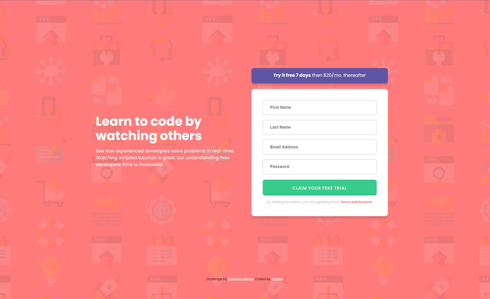
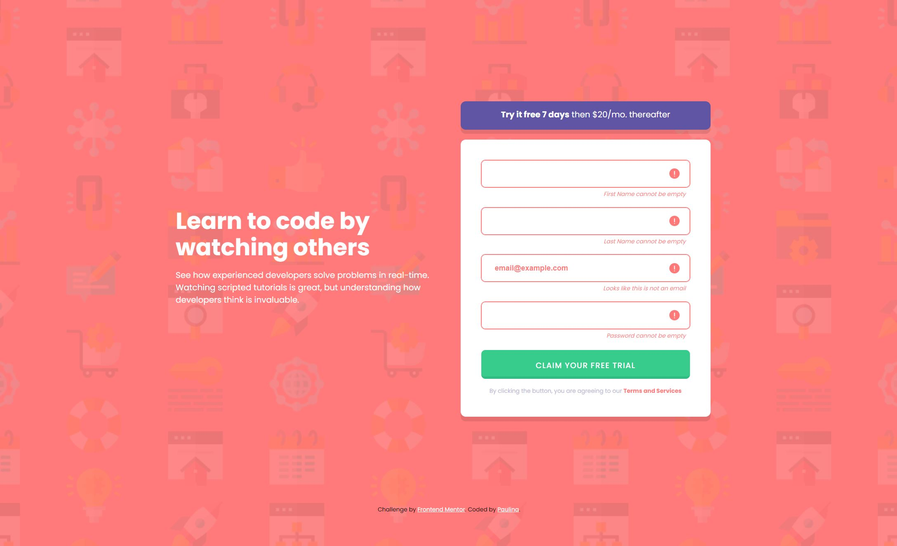

# Frontend Mentor - Intro component with sign up form solution

This is a solution to the [Intro component with sign up form challenge on Frontend Mentor](https://www.frontendmentor.io/challenges/intro-component-with-signup-form-5cf91bd49edda32581d28fd1). 

## Table of contents

- [Overview](#overview)
  - [The challenge](#the-challenge)
  - [Screenshots](#screenshot)
  - [Link](#link)
- [My process](#my-process)
  - [Design](#design)
  - [Development](#development)
  - [Built with](#built-with)
  - [What I learned](#what-i-learned)

## Overview
The challenge was to create an interactive sign-up form for a learning platform. This was a project from Frontend Mentor.

The form fields, such as first name, last name, email, and password, should validate on form submission and show error messages for invalid or empty inputs. The email field has additional validation for correct email structure. The form should not be submitted if any validation fails.

### The challenge

Users should be able to:

- View the optimal layout for the site depending on their device's screen size
- See hover states for all interactive elements on the page
- Receive an error message when the `form` is submitted if:
  - Any `input` field is empty. The message for this error should say *"[Field Name] cannot be empty"*
  - The email address is not formatted correctly (i.e. a correct email address should have this structure: `name@host.tld`). The message for this error should say *"Looks like this is not an email"*

### Screenshot

### Link

- Live Site URL: (https://intro-component-with-sign-up-form-pk.netlify.app/)

## My process

### Design
I was provided with a design for this project from Frontend Mentor.

The form was designed to be mobile-first with a responsive layout that adapts to larger screen sizes. On mobile, the form and information text are stacked vertically, and on larger screens, they align side by side.

The design includes an error state for each form field that is triggered when the user tries to submit the form without completing the fields properly.

### Development
The development process was divided into two parts:

First, the HTML and CSS of the project were implemented. The CSS was written with reusability and efficiency in mind.

Second, the JavaScript functionality was implemented. It includes functions to validate the form fields, display error messages, and prevent the form from being submitted when the input fields are not filled out correctly.

### Built with

- Semantic HTML5 markup
- CSS custom properties
- CSS Grid
- Mobile-first workflow
- JavaScript for form validation

### What I learned

Through this project, I enhanced my skills with form validation using JavaScript. I also gained more experience with CSS Grid and mobile-first design. Handling error states in CSS was a valuable part of the learning process. Overall, it was a great project for reinforcing my skills with JavaScript, CSS, and HTML.

